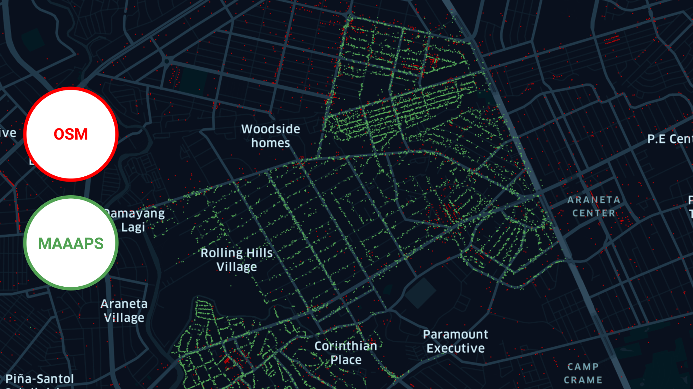

# Overview
[Maaaps](https://maaaps.io?utm_source=github&utm_medium=readme) is a geocoding and autocomplete suggestions API powered by crowdsourced data collection.

We have addresses and coordinates 100K+ buildings in Metro Manila with rooftop precision. All addresses are collected manually by field surveyors and then cross-validated to ensure the data is correct. Every week me maps 1000s of new addresses. In general, Maaaps coverage is much denser than OpenStreetMap:

# Getting Started
APIs are available for:
- non-profit users (e.g. universities or research centers) free of charge
- commercial customers with pricing based on volume of API calls

To get access, [schedule a call](https://calendly.com/maaaps/geocoding) with our team and we'll provide you with the quote, API key and onboarding on the platform.
# Use Cases
Maaaps would be mostly useful for logistics companies:
- grocery delivery companies or dark stores
- cloud kitchens, food delivery and meal subscription businesses
- crowdsourced delivery services
- parcel delivery, 3PL and fulfillment companies

High-precision geographical data means routing algorithms

Geocoding results can be displayed on any base map or fed to any directions API or routing engine. Caching, storage, compilation of derivated databases out of Maaaps geocoding results and suggestion lists longer than 14 days and reselling is prohibited.

Documentation:
- [forward geocoding](https://github.com/maaaps-io/docs/blob/master/API.md#direct-geocoder) turns a string address into a pair of coordinates and correct address split into address parts (region, city, street, postcode, building number)
- [reverse geocoding](https://github.com/maaaps-io/docs/blob/master/API.md#reverse-geocoder) turns a pair of coordinates into a string address (or X nearest addresses or all addresses within Y meters) split into address parts
- [autocomplete suggestions](https://github.com/maaaps-io/docs/blob/master/API.md#suggestions) turn a string into a list of 10 most likely addresses – e.g. "Metro Ma" would return 10 addresses in Metro Manila – split into address parts 
